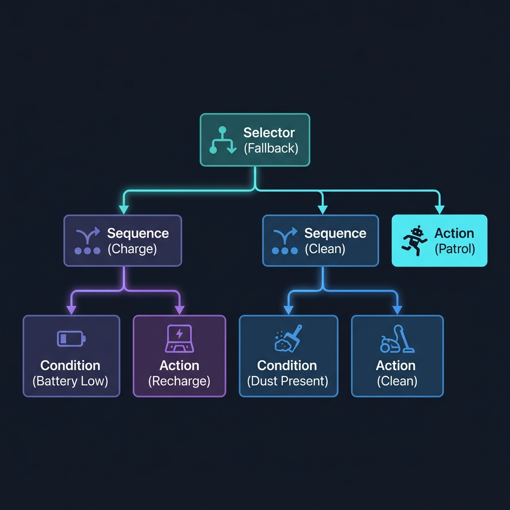

# Agent Behavior Trees in Prolog

This project implements a lightweight and modular **Behavior Tree (BT) engine** in Prolog, demonstrating how to use BTs to control agent decision-making.

## Why This Project is Useful
Behavior Trees (BTs) are a standard control architecture in game AI and robotics. They organize decision-making hierarchically, making agent behavior highly modular, readable, and easy to debug compared to traditional Finite State Machines (FSMs).

Prolog's pattern matching, backtracking, and dynamic databases make it an ideal language for:
1. **Defining a DSL (Domain-Specific Language)** to declare tree nodes (`sequence`, `selector`, `action`, `condition`).
2. **Evaluating the tree structure** using elegant recursive pattern matching.
3. **Representing and updating agent state** naturally using dynamic predicates.

This project shows how to construct a generic behavior tree interpreter in under 100 lines of Prolog and use it to drive a stateful cleaning robot agent.

## Tools & Libraries Used
- **SWI-Prolog**: No external libraries are needed, as the tree interpreter is built using core Prolog features.

## Project Architecture
The Behavior Tree consists of a root node that is "ticked" at regular intervals. The nodes evaluate their children recursively:



## How to Run the Example

Start the simulation by running:

```bash
swipl -g "run_simulation(10), halt." -t "halt(1)" prolog/robot_agent.pl
```

### Expected Output
The output will show a tick-by-tick trace of the robot's battery state, environment, which conditions were evaluated, which actions were executed, and the final state:

```text
[Tick 6]
[State] Battery: 30%, Dusty: false
[Action] Patrolling rooms... Battery at 15%
[BT] Root execution status: success

[Tick 7]
[State] Battery: 15%, Dusty: false
[Cond] Battery is low: 15%
[Action] Charging... Battery increased from 15% to 65%
[BT] Root execution status: success
```
