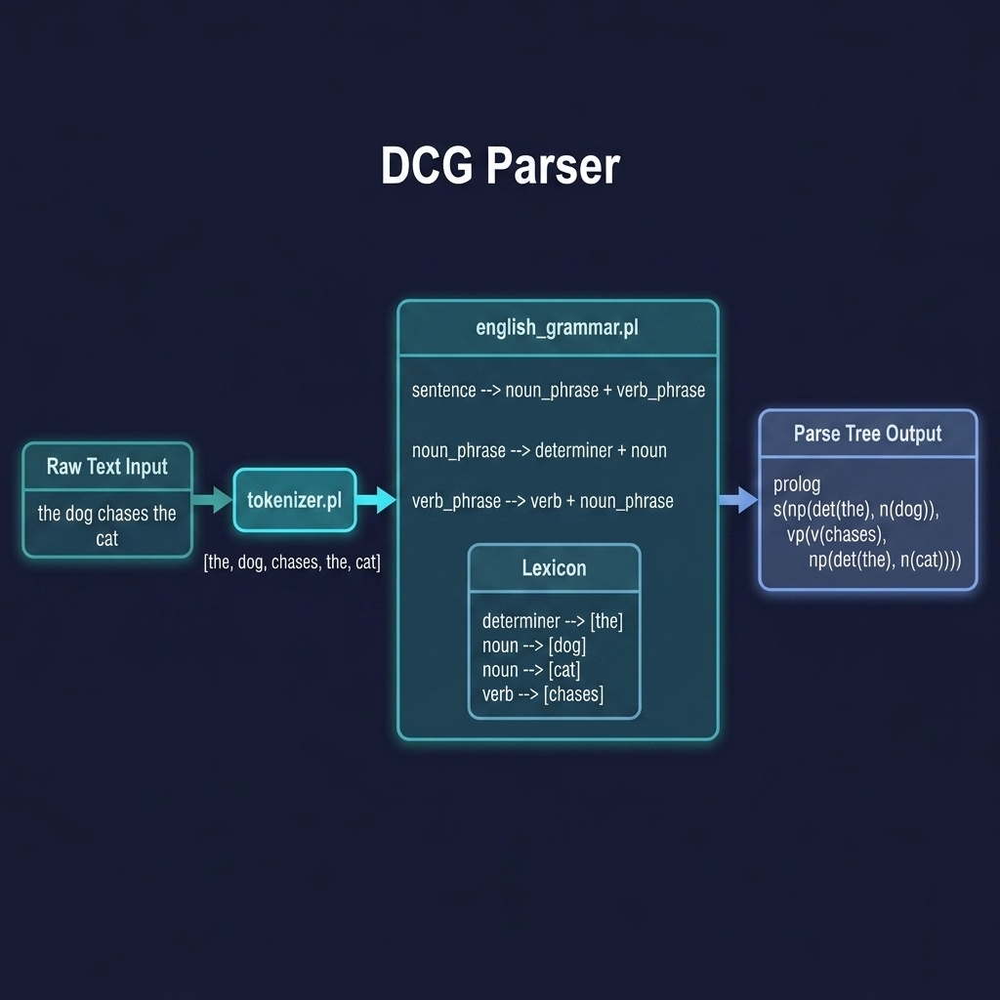

# DCG Parser

Natural language parsing using Definite Clause Grammars with parse tree construction. Companion code for the NLP with DCGs chapter.

## Running Examples

```shell
cd source-code/dcg_parser
swipl -s load.pl
```

```prolog
?- parse_sentence([the, dog, chases, the, cat], Tree).
?- parse_sentence([john, walks, in, the, park], Tree).
```

## Running Tests

```shell
swipl -g "['tests/test_grammar.pl'], run_tests, halt" -s load.pl
```


## Architecture



## Description

Demonstrates Prolog's DCG notation — one of the language's most elegant features — for parsing simple English sentences. The `english_grammar.pl` module defines a grammar with noun phrases, verb phrases, prepositional phrases, and a small lexicon. Each rule builds a parse tree term as it matches, producing structured output like `s(np(det(the), n(dog)), vp(v(chases), np(det(the), n(cat))))`. The `tokenizer.pl` module provides a simple string-to-word-list converter for preparing raw text input.
