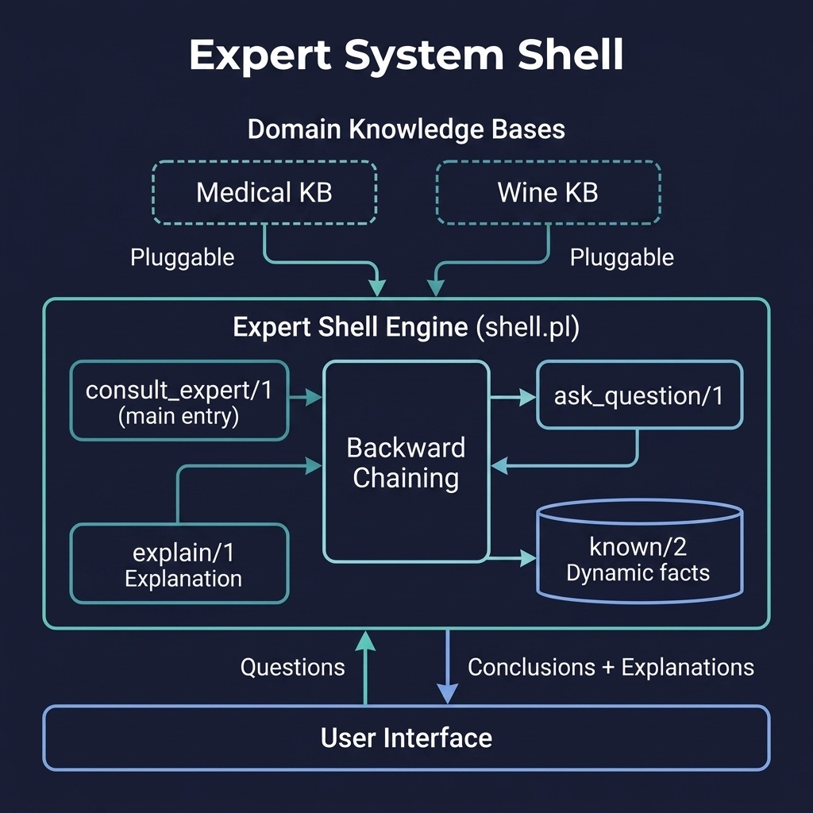

# Expert System Shell

A reusable expert system shell with backward chaining and explanation facilities. Companion code for the Expert Systems chapter.

## Running Examples

```shell
cd source-code/expert_shell
swipl -s load.pl
```

```prolog
?- consult_expert(Conclusion).
?- explain(Conclusion).
```

## Running Tests

```shell
swipl -g "['tests/test_shell.pl'], run_tests, halt" -s load.pl
```


## Architecture



## Description

Provides a domain-independent expert system shell that can be loaded with different knowledge bases. The shell supports backward chaining inference with user interaction via `ask_question/1`, maintains a database of known facts provided by the user during consultation, and includes an explanation facility that can trace the reasoning chain leading to a conclusion. The architecture separates the inference engine from domain knowledge, following the classic expert system design pattern.
