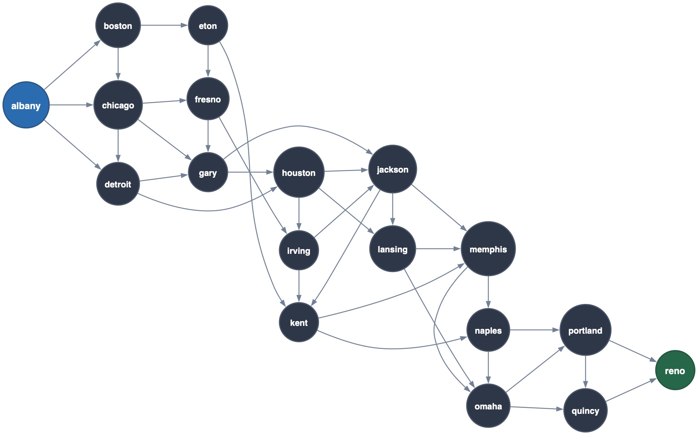

# Graph Search

Depth-first search, breadth-first search, and A* heuristic search over graphs. Companion code for the Search Algorithms chapter.

## Sample Graph

The search algorithms operate on a 20-node directed graph loaded at runtime from `sample_graph.txt`:



**Start node:** albany (blue) · **Goal node:** reno (green)

## Running Examples

```shell
cd source-code/graph_search
swipl -s load.pl
```

```prolog
?- dfs(albany, reno, Path).
?- bfs(albany, reno, Path).
?- astar(albany, reno, distance_heuristic, Path).
```

## Running Tests

```shell
swipl -g "['tests/test_search.pl'], run_tests, halt" -s load.pl
```


## Architecture


## Description

Implements three classic AI search algorithms over a sample directed graph. The graph is loaded at runtime from `sample_graph.txt` by `read_graph.pl`, which asserts `edge/2` facts dynamically. `dfs.pl` performs depth-first search with cycle detection using a visited list. `bfs.pl` uses an explicit queue to explore nodes level by level. `astar.pl` implements A* with a pluggable heuristic predicate (uses `safe_call/3` to handle missing heuristics gracefully), maintaining an open list sorted by f-cost.
