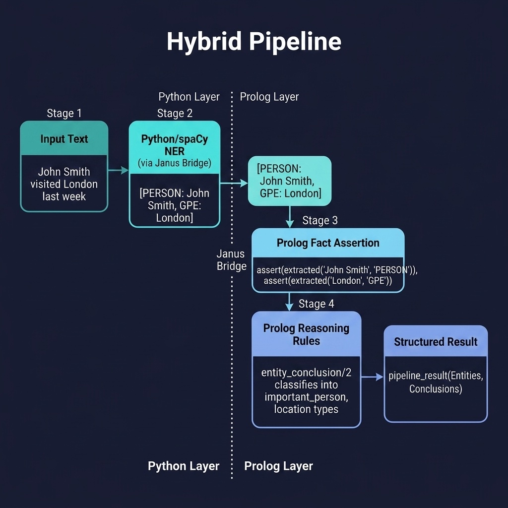

# Hybrid Pipeline

Python NLP preprocessing combined with Prolog reasoning via Janus. Companion code for the Janus Python Bridge chapter.

## Running Examples

```shell
swipl -s load.pl
```

```prolog
?- run_pipeline("John Smith visited London last week", Result).
```

Requires SWI-Prolog with Janus support and Python with spaCy installed.

### Python dependencies

Install the pinned Python dependencies and the spaCy language model:

```shell
uv sync                              # installs spacy from pyproject.toml
uv run python -m spacy download en_core_web_sm
```

(Equivalently, `pip install spacy` and `python -m spacy download en_core_web_sm` in any environment.)

### Fallback behaviour

If spaCy or the `en_core_web_sm` model is not installed, `python/nlp_bridge.py`
silently falls back to a small rule-based recogniser (`mock_entities/1`) that
knows the names used by the tests (`John`, `Smith`, `London`, `Paris`), so the
pipeline keeps working offline.  `extract_entities/1` returns the same shape in
both modes — a list of `{'text': ..., 'label': ...}` dicts that Janus converts
to Prolog dicts in one pass.  Only `PERSON` and `GPE` labels are mapped to
conclusions; other spaCy labels are deliberately dropped.

If SWI-Prolog's Janus extension itself cannot load (macOS RPATH issue — see
the `janus_ml_python_interop` README for the `install_name_tool` workaround),
the test-suite (`tests/test_pipeline.pl`) consults a pure-Prolog mock
(`tests/mock_janus.pl`) instead, so `make test` always exercises the symbolic
layer.

## Running Tests

```shell
swipl -g "['tests/test_pipeline.pl'], run_tests, halt" -s load.pl
```


## Architecture



## Description

A full hybrid AI pipeline: Python/spaCy performs named entity recognition on input text, the extracted entities are asserted as Prolog facts, and Prolog rules classify them (e.g., persons as `important_person`, locations as `location`). This demonstrates the architecture where Python handles statistical NLP and Prolog handles symbolic reasoning — each language used for what it does best.
