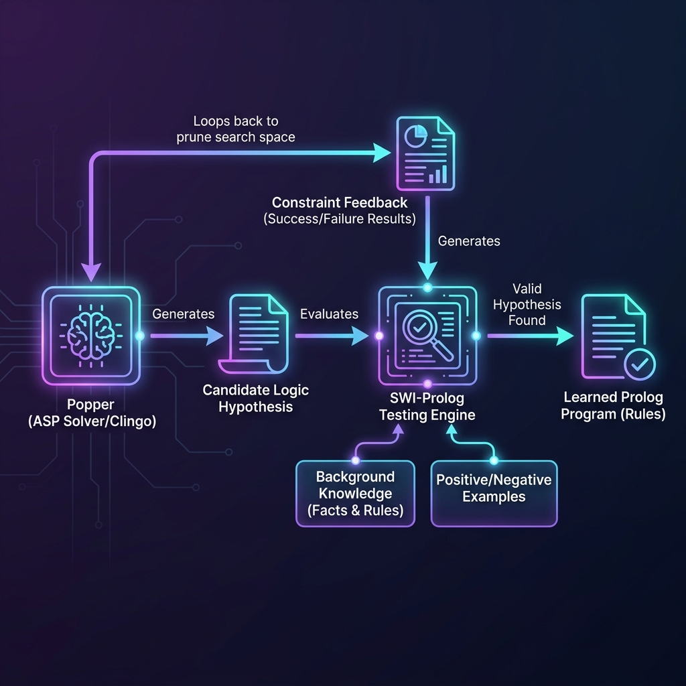

# Inductive Logic Programming with Popper

This project demonstrates **Inductive Logic Programming (ILP)**, a subfield of machine learning where a system learns logic programs (Prolog rules) from background knowledge and examples.

## Why This Project is Useful
Traditional machine learning (like deep neural networks) fits mathematical functions to numerical data. The resulting model is a high-dimensional tensor of weights, which is difficult for humans to inspect or verify.

**Inductive Logic Programming (ILP)** takes a different approach:
- It takes a set of positive and negative examples (data).
- It takes background knowledge (existing facts and rules).
- It outputs a **symbolic Prolog program** that perfectly models the rules.

This program is human-readable, mathematically exact, and can be immediately loaded into a Prolog engine to verify its correctness. 

This example uses **Popper**, a state-of-the-art ILP engine. Popper uses Answer Set Programming (ASP) to generate candidate logic programs (rules), and then uses Prolog to test if they entail the positive examples without entailing any negative examples. If a candidate fails, Popper extracts symbolic constraints (failures) to prune the search space, repeating until it finds a minimal solution.

## Tools & Libraries Used
- **SWI-Prolog**: Used by Popper to execute and test candidate rules.
- **Python (managed via `uv`)**: The coordination and search wrapper.
- **Clingo (ASP Solver)**: Used to generate candidate hypotheses.
- **Popper**: The inductive logic engine itself.

## Project Architecture
Refer to the architecture diagram for an overview of the system loop:



## How to Run the Example

Ensure `uv` is installed, then run the Python wrapper script:

```bash
uv run run_popper.py
```

### Expected Output
Popper will search the hypothesis space and output the minimal rule that defines the `grandparent` relationship:

```text
grandparent(A,B):- parent(A,C),parent(C,B).
```
