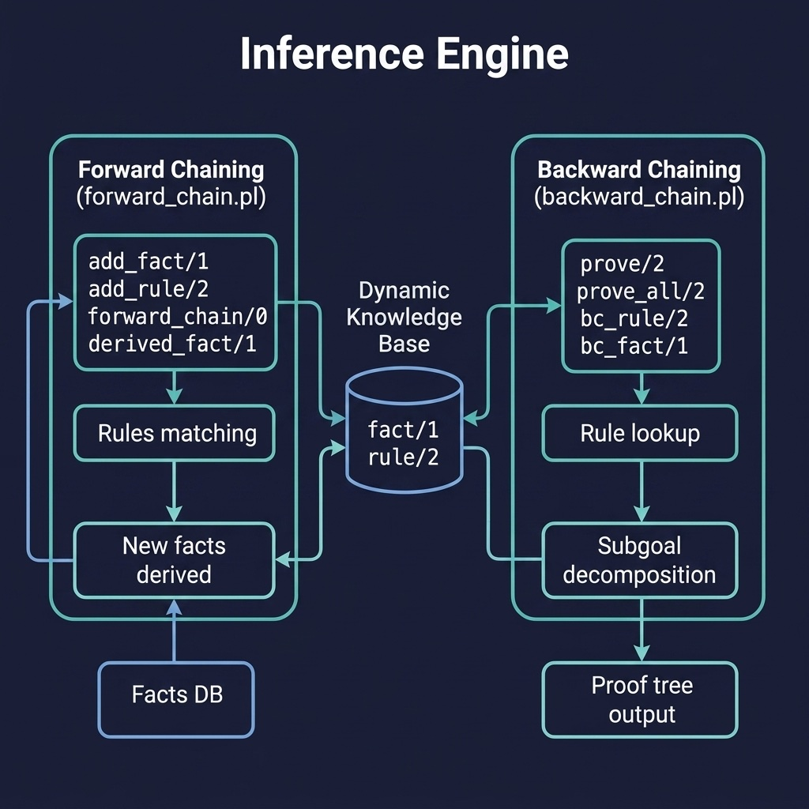

# Inference Engine

Forward and backward chaining inference engines with proof tree generation. Companion code for the Reasoning and Inference chapter.

## Running Examples

```shell
cd source-code/inference_engine
swipl -s load.pl
```

```prolog
?- add_fact(raining), add_rule([raining], wet_ground), forward_chain.
?- derived_fact(wet_ground).
```

## Running Tests

```shell
swipl -g "['tests/test_inference.pl'], run_tests, halt" -s load.pl
```


## Architecture



## Description

Implements two fundamental reasoning strategies. The `forward_chain.pl` module performs data-driven reasoning — it repeatedly applies rules whose conditions are satisfied by known facts, deriving new facts until no more can be produced (fixpoint). The `backward_chain.pl` module works goal-directed, starting from a query and recursively trying to prove it via rules and facts, producing a proof tree that explains the reasoning chain. Both engines use dynamic predicates for facts and rules, making them easy to load with different knowledge bases.
