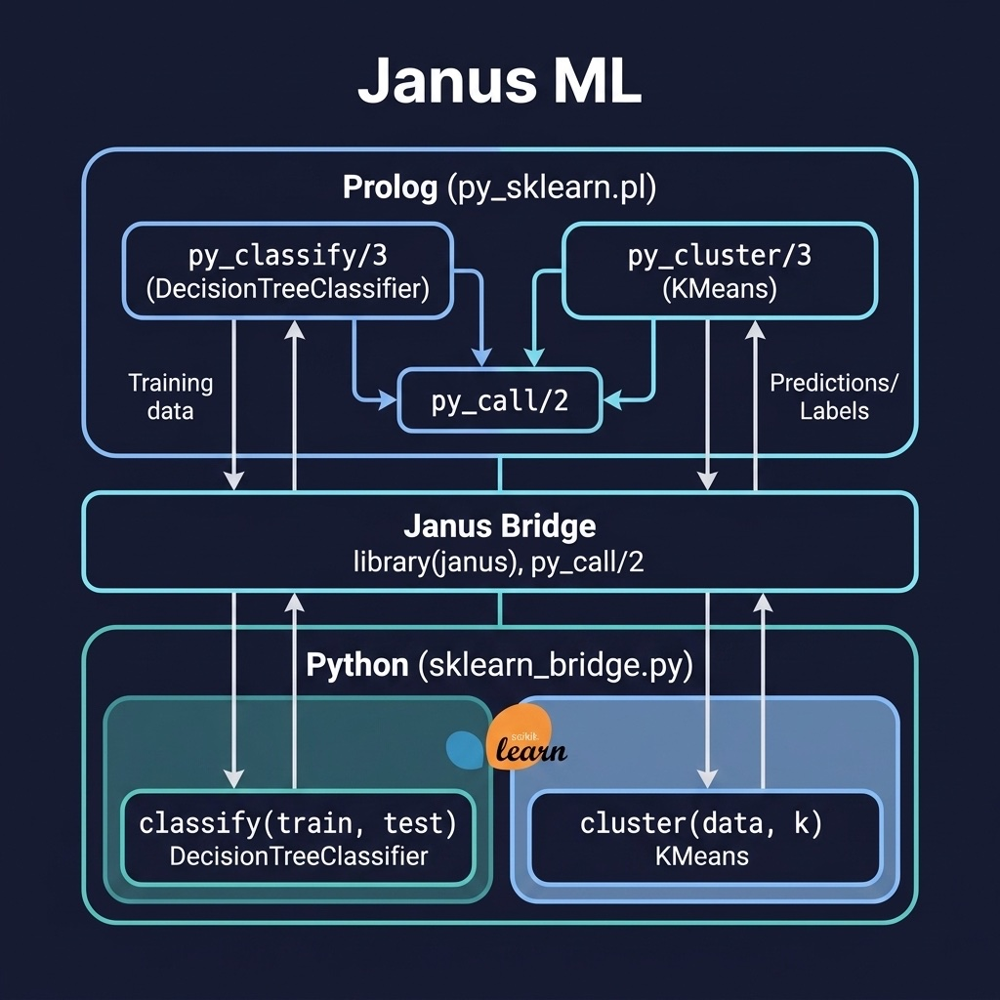

# Janus ML

Call Python's scikit-learn from Prolog via the Janus bridge. Companion code for the Janus Python Bridge chapter.

## Running Examples

First, initialize the Python environment and install dependencies using `uv`. Note: you must specify the Python version that matches the one SWI-Prolog's Janus bridge was compiled against (e.g., Python 3.9):

```shell
uv sync --python 3.9
```

Then run the examples using `uv run` to ensure the virtual environment is used:

```shell
uv run swipl -s load.pl
```

```prolog
?- py_classify([[1,0,0],[0,1,1],[1,1,0]], [[0,0,1]], Predictions).
?- py_cluster([[1,2],[3,4],[1,3],[5,6]], 2, Labels).
```

Requires SWI-Prolog compiled with Janus support and `uv` installed for Python dependency management.

## Running Tests

```shell
uv run swipl -g "['tests/test_janus_ml.pl'], run_tests, halt" -s load.pl
```


## Architecture



## Description

Demonstrates the Janus Python bridge for calling scikit-learn's DecisionTreeClassifier and KMeans clusterer directly from Prolog. The `py_sklearn.pl` module provides Prolog predicates that delegate to `python/sklearn_bridge.py` via `py_call/2`. This pattern lets you use Python's mature ML ecosystem while keeping Prolog as the orchestration and reasoning layer.
