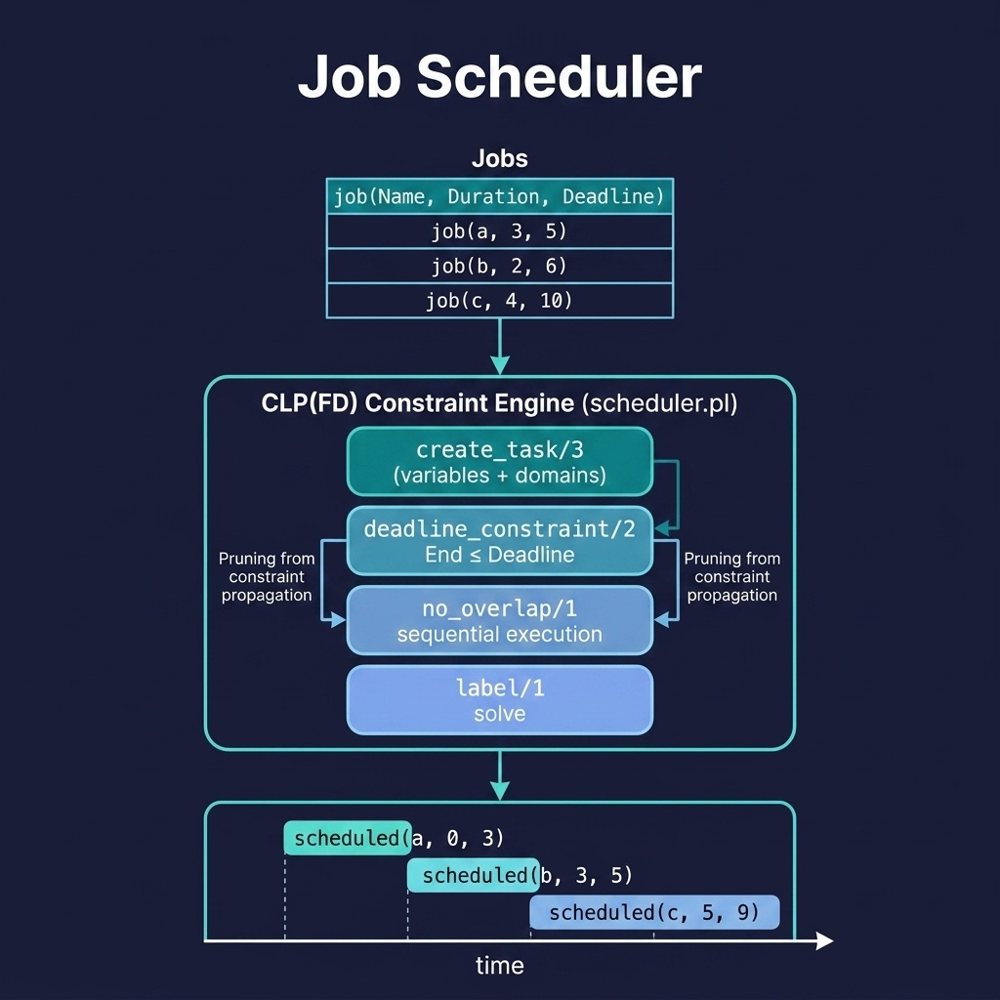

# Job Scheduler

Constraint-based job scheduling with temporal constraints using CLP(FD). Companion code for the Constraint Logic Programming chapter.

## Running Examples

```shell
cd source-code/job_scheduler
swipl -s load.pl
```

```prolog
?- schedule_jobs([job(a, 3, 10), job(b, 2, 8), job(c, 4, 20)], Schedule).
```

A more complex scheduling problem with tighter deadlines and more tasks:

```prolog
?- schedule_jobs([job(a, 3, 5), job(b, 2, 6), job(c, 4, 10), job(d, 1, 11), job(e, 2, 13), job(f, 5, 18)], Schedule).
```

## Running Tests

```shell
swipl -g "['tests/test_scheduler.pl'], run_tests, halt" -s load.pl
```


## Sample Data Problem

The example data models a small production floor where six jobs must be scheduled on a single machine. Each job is defined as `job(Name, Duration, Deadline)`:

| Job | Duration | Deadline | Description |
|-----|----------|----------|-------------|
| a   | 3        | 5        | Medium task with a tight deadline |
| b   | 2        | 6        | Short task that must finish early |
| c   | 4        | 10       | Longer task with a moderate deadline |
| d   | 1        | 11       | Quick task that fits in small gaps |
| e   | 2        | 13       | Short task with a relaxed deadline |
| f   | 5        | 18       | Long task that must finish by the end |

The total work is 17 time units, and the latest deadline is 18. The scheduler must respect three constraints:

1. **No overlap** — only one job runs at a time on the shared machine.
2. **Deadline respect** — each job must finish by its deadline.
3. **Ordering** — jobs are ordered by start time (the `chain/2` constraint).

Because jobs `a` and `b` have tight deadlines and job `d` is very short, the constraint solver must explore different orderings to find a feasible packing. This makes the example a better demonstration of backtracking and constraint propagation than the original three-job version, where the schedule is trivially sequential with no real deadline pressure.

## Architecture



## Description

Demonstrates a practical application of CLP(FD) for scheduling problems. Each job has a name, duration, and deadline. The scheduler creates constrained start/end time variables, enforces non-overlapping execution, respects deadlines, and uses `label/1` to find feasible schedules. This pattern extends naturally to real-world applications like production scheduling, resource allocation, and project planning — domains where Prolog's constraint-based approach offers significant advantages over imperative solutions.
