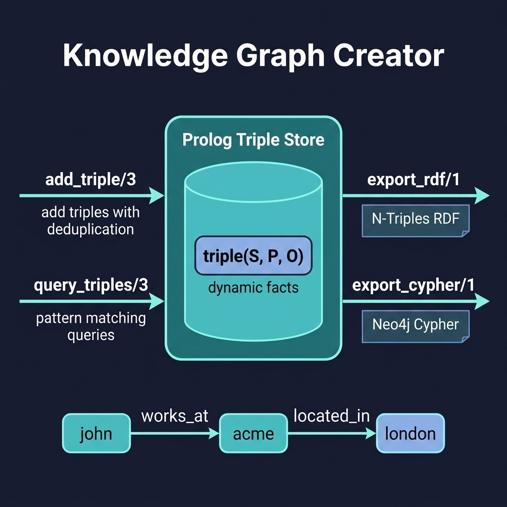

# Knowledge Graph Creator

Build knowledge graphs from text and export to RDF or Cypher formats. Companion code for the Knowledge Graphs chapter.

## Running Examples

```shell
cd source-code/kg_creator
swipl -s load.pl
```

```prolog
?- add_triple(john, works_at, acme).
?- add_triple(acme, located_in, london).
?- query_triples(john, _, X).
?- export_rdf('output.nt').
?- export_cypher('output.cypher').
```

## Running Tests

```shell
swipl -g "['tests/test_kg.pl'], run_tests, halt" -s load.pl
```


## Architecture



## Description

Stores knowledge as subject-predicate-object triples using Prolog's dynamic database — a natural fit since Prolog's fact base *is* essentially a knowledge graph. The `kg_builder.pl` module provides predicates to add triples (with deduplication), query them with pattern matching, and export the graph in two formats: N-Triples RDF for semantic web tools and Cypher CREATE statements for Neo4j. This demonstrates how Prolog can serve as both the knowledge representation language and the query engine for knowledge graphs.
