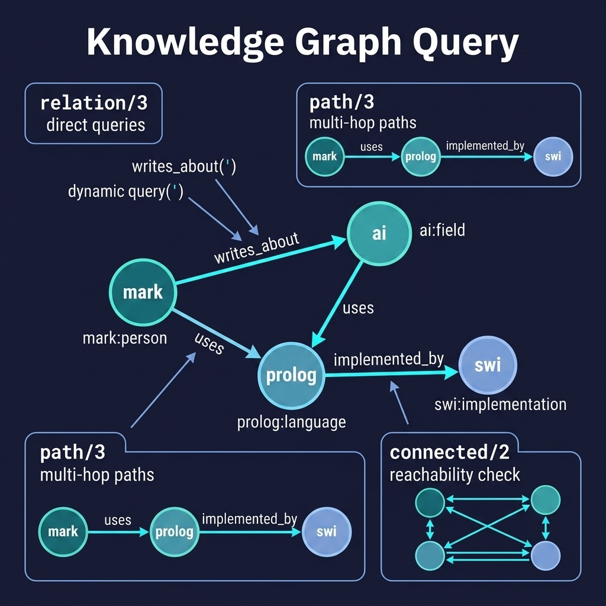

# Knowledge Graph Query

Multi-hop reasoning and path finding over knowledge graphs. Companion code for the Knowledge Graphs chapter.

## Running Examples

```shell
cd source-code/kg_query
make run
```

Or interactively:

```shell
swipl -s load.pl
```

```prolog
?- relation(mark, uses, prolog).
?- path(mark, swi, Path).
?- connected(mark, swi).
?- reachable(mark, Reachable).
?- all_paths(sarah, bert, Paths).
?- path(clojure, lisp, Path).
?- path(mark, transformer, Path).
?- relation_count(uses, Count).
```

## Running Tests

```shell
make test
```

Or directly:

```shell
swipl -g "['tests/test_kg_reason.pl'], run_tests, halt" -s load.pl
```

## Architecture



## Description

Extends the knowledge graph concept with multi-hop reasoning capabilities. The `kg_reason.pl` module stores entities with types and directional relations, then provides:

- `path/3` - Find chains of relations connecting two entities
- `connected/2` - Check reachability in either direction
- `neighbors/3` - Find all direct neighbors with predicates
- `path_length/3` - Find path length between entities
- `all_paths/3` - Find all paths between entities
- `reachable/2` - Find all entities reachable from a given entity
- `relation_count/2` - Count relations with a given predicate

The sample data (`sample_data.pl`) contains 370+ assertions modeling relationships between people, programming languages, research fields, implementations, organizations, concepts, projects, and publications. This showcases Prolog's natural advantage for graph traversal — recursive path finding with backtracking is trivial to express declaratively.