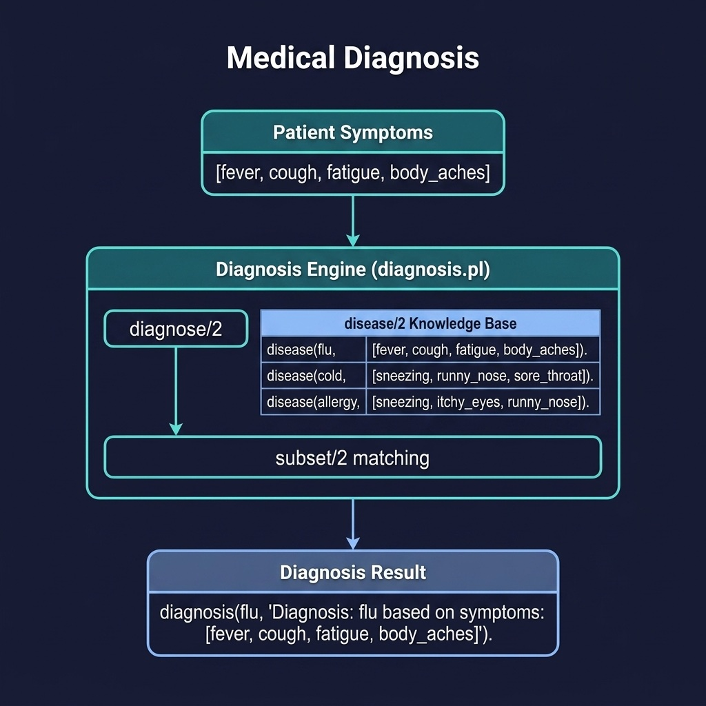

# Medical Diagnosis

A symptom-based medical diagnosis system demonstrating reasoning with explanation. Companion code for the Reasoning and Inference chapter. This is a simple rules-based system: see comments below.

## Running Examples

```shell
cd source-code/medical_diagnosis
swipl -s load.pl
```

```prolog
?- diagnose([fever, cough, fatigue, body_aches], Result).
?- diagnose([sneezing, runny_nose, sore_throat], Result).
```

## Running Tests

```shell
swipl -g "['tests/test_diagnosis.pl'], run_tests, halt" -s load.pl
```


## Architecture



## Description

A practical case study applying Prolog reasoning to medical diagnosis. The system maintains a knowledge base of diseases and their required symptoms, then matches a patient's symptom list against disease profiles using `subset/2`. When a match is found, it returns a `diagnosis(Disease, Explanation)` term that includes the matching symptoms. This demonstrates how Prolog's pattern matching and logical inference naturally support diagnostic reasoning — a domain where expert systems have historically excelled.

## Comments on rules-based vs. Bayesian or Frequentist approaches (see chapter "Probability")

This Prolog code is neither Bayesian nor Frequentist. Instead, it is a Symbolic/Rule-Based system using Deductive
  Logic.

  1. Why it is NOT Bayesian
   * No Probabilities: Bayesian systems rely on conditional probabilities ($P(Disease|Symptom)$) and prior beliefs
     ($P(Disease)$). This code uses binary logic: either a symptom is present or it is not.
   * No Uncertainty Handling: It does not account for the likelihood that a patient with a cold might not have a sore
     throat. It treats the relationship between diseases and symptoms as absolute and deterministic.

  2. Why it is NOT Frequentist
   * No Statistical Inference: Frequentist methods are based on the frequency of events in repeated trials (e.g.,
     $p$-values, confidence intervals). This code does not analyze data or calculate frequencies; it applies pre-defined
     expert rules.

  3. Description of the Paradigm: Symbolic Logic (Expert System)
  The code implements a Knowledge-Based System using Pattern Matching and Set Membership:

   * Deductive Reasoning: It uses a "Knowledge Base" (the disease/2 predicates) to define what constitutes a disease.
   * Strict Matching: The core logic subset(RequiredSymptoms, Symptoms) means that for a diagnosis to be made, all
     "RequiredSymptoms" for that disease must be present in the user's list. 
   * Non-Probabilistic: It is "exact." If a patient has 3 out of 4 flu symptoms, the system will fail to diagnose the flu
     entirely rather than saying "75% chance of flu."
   * Procedural State Management: It uses assert_symptom and retract_symptoms to temporarily store the patient's state in
     the Prolog database, though the current implementation primarily relies on the list-based subset/2 check.

  Summary: This is a classic "Toy" Expert System. It is excellent for clear, "if-then" deterministic rules but cannot
  handle the "noisy" or uncertain data that Bayesian or Frequentist models are designed for.
  
