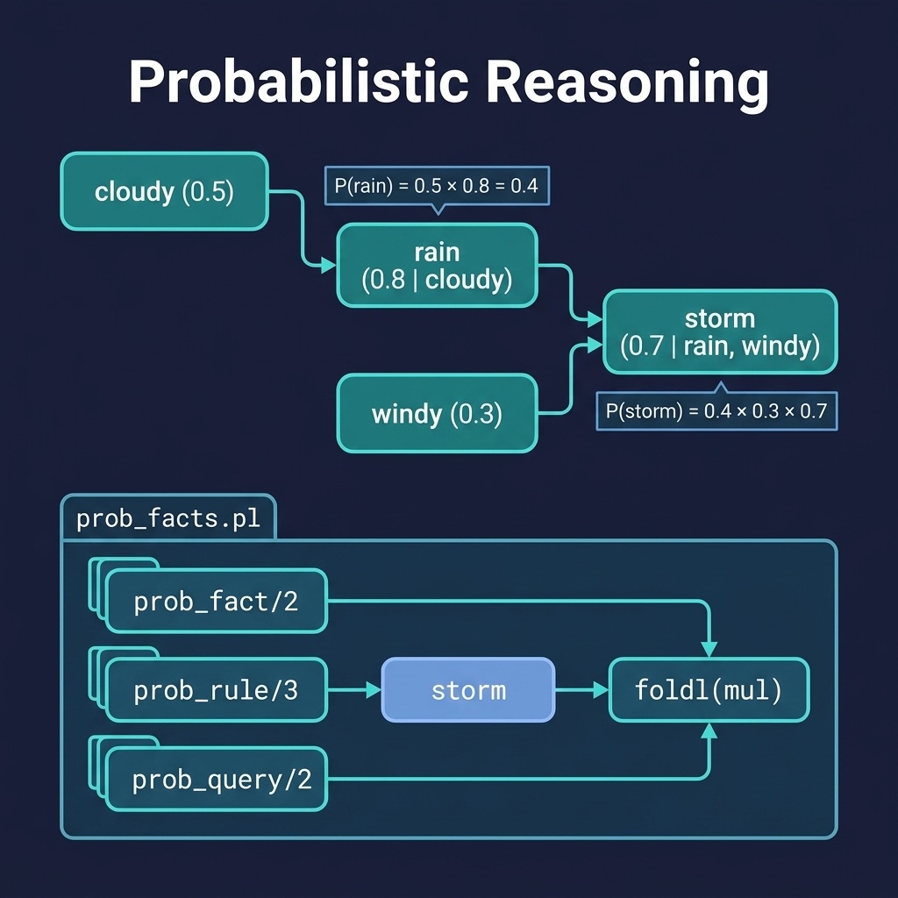

# Probabilistic Reasoning

Lightweight probabilistic reasoning with certainty factor propagation. Companion code for the Probabilistic Logic Programming chapter.

## Running Examples

```shell
cd source-code/prob_reasoning
swipl -s load.pl
```

```prolog
?- prob_query(cloudy, P).
?- prob_query(rain, P).
?- prob_query(storm, P).
```

## Running Tests

```shell
swipl -g "['tests/test_prob.pl'], run_tests, halt" -s load.pl
```

## Complex Weather Example

A more elaborate knowledge base with 5 base facts, 7 rules, and 4 levels of reasoning depth demonstrates how probability chains compound across deep inference paths. Two separate reasoning streams converge at `severe_storm`:

```
low_pressure ──0.8──▶ unstable_air ──0.5──▶ thick_clouds ─┐
(high_humidity = 0.5)    (with high_humidity)              ├─0.5─▶ severe_storm ──0.6──▶ tornado_risk
                                                         │                    └──0.8──▶ flash_flood_risk
cold_front  ──0.6──▶ frontal_zone ──0.8──▶ storm_system ─┘
warm_front       (jet_stream_dip = 0.5)
```

Running the complex example:

```shell
swipl -g "prob_query(unstable_air, P1), format('P(unstable_air) = ~w~n', [P1]), prob_query(thick_clouds, P2), format('P(thick_clouds) = ~w~n', [P2]), prob_query(frontal_zone, P3), format('P(frontal_zone) = ~w~n', [P3]), prob_query(storm_system, P4), format('P(storm_system) = ~w~n', [P4]), prob_query(severe_storm, P5), format('P(severe_storm) = ~w~n', [P5]), prob_query(tornado_risk, P6), format('P(tornado_risk) = ~w~n', [P6]), prob_query(flash_flood_risk, P7), format('P(flash_flood_risk) = ~w~n', [P7]), halt" -s load.pl
```

Expected output:

```
P(unstable_air) = 0.4         (0.5 × 0.8)
P(thick_clouds) = 0.1         (0.5 × 0.4 × 0.5)
P(frontal_zone) = 0.15        (0.5 × 0.5 × 0.6)
P(storm_system) = 0.06        (0.15 × 0.5 × 0.8)
P(severe_storm) = 0.003       (0.1 × 0.06 × 0.5)
P(tornado_risk) = 0.0018      (0.003 × 0.6)
P(flash_flood_risk) = 0.0024  (0.003 × 0.8)
```

This example illustrates how deeply chained probabilistic inference causes rapid probability attenuation: even with moderate conditional probabilities (0.5–0.8), four levels of chained reasoning reduce the base 0.5 probability to 0.0018 for tornado risk — a factor of ~278× reduction. This property is characteristic of naive probability multiplication and motivates more sophisticated approaches (e.g., Bayesian networks with proper conditional independence) for real-world applications.


## Architecture



## Description

Implements a simple probabilistic reasoning system without external pack dependencies. Facts are annotated with probabilities (`prob_fact/2`), and rules specify conditional probabilities (`prob_rule/3`). The `prob_query/2` predicate computes the probability of a goal by multiplying the probabilities along the inference chain. This provides an accessible introduction to reasoning under uncertainty before moving to more sophisticated frameworks like ProbLog or cplint. The example knowledge base models weather relationships: cloudy → rain → storm.
