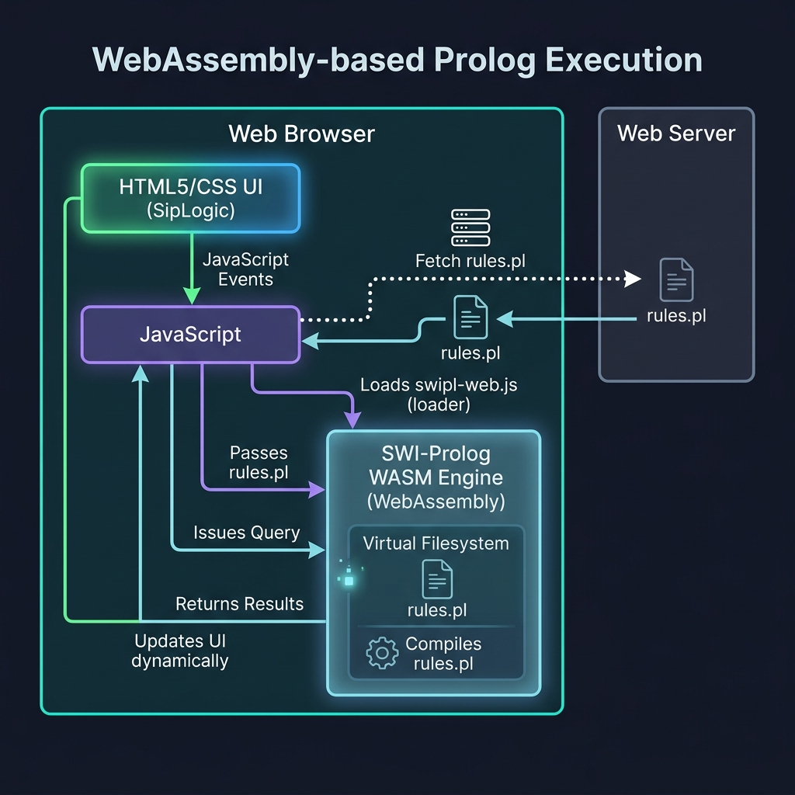

# SWI-Prolog WebAssembly (WASM) Browser Application

This project demonstrates **client-side deployment** of a Prolog expert system directly inside the web browser using WebAssembly.

## Why This Project is Useful
Traditionally, running a Prolog rule-base required a backend server (e.g. using an HTTP API or Janus integration with Python). This introduces server cost, network latency, and complexity.

**WebAssembly (WASM)** makes it possible to compile the entire SWI-Prolog runtime into a sandboxed binary that runs inside the user's browser:
1. **Zero Server Overhead**: The code runs entirely on the client, meaning no backend infrastructure is needed.
2. **Instant Response**: Queries execute locally in microseconds, enabling real-time UI updates as the user interacts with controls.
3. **Offline Capabilities**: Once loaded, the expert system works completely offline.

This example builds a premium, interactive **Wine Advisor dashboard** that consults local rules and dynamically finds matches using SWI-Prolog WASM.

## Tools & Libraries Used
- **SWI-Prolog WASM (`swipl-wasm`)**: The Emscripten-compiled build of SWI-Prolog. Loaded via the official SWI-Prolog GitHub Pages CDN.
- **HTML5 & Vanilla CSS**: A modern glassmorphism dark-mode UI styled for premium aesthetics.

## Project Architecture
The browser downloads the WASM build and the local Prolog rules, compiles them in memory, and binds UI inputs directly to the query loop:



## How to Run the Example

Because the browser needs to load the `.wasm` and `.data` files from the CDN and fetch the local `rules.pl` file, you must serve the directory using a local HTTP server to avoid CORS issues.

Run the dev server using Python:

```bash
python -m http.server 8000 --directory .
```

Open [http://localhost:8000](http://localhost:8000) in your web browser.

### Expected Behavior
1. The status badge will show **Prolog Loading...** with a red dot.
2. Once initialized, the badge will glow green with **Prolog WASM Online**.
3. Selecting different pairing foods, wine bodies, or sweetness levels will dynamically execute Prolog queries and render recommended pairing cards on the right.
4. Each card contains a logic-driven explanation returned by the Prolog rules explaining why the pairing is suitable.
5. If no matches exist, an empty state is shown recommending broader filters.
