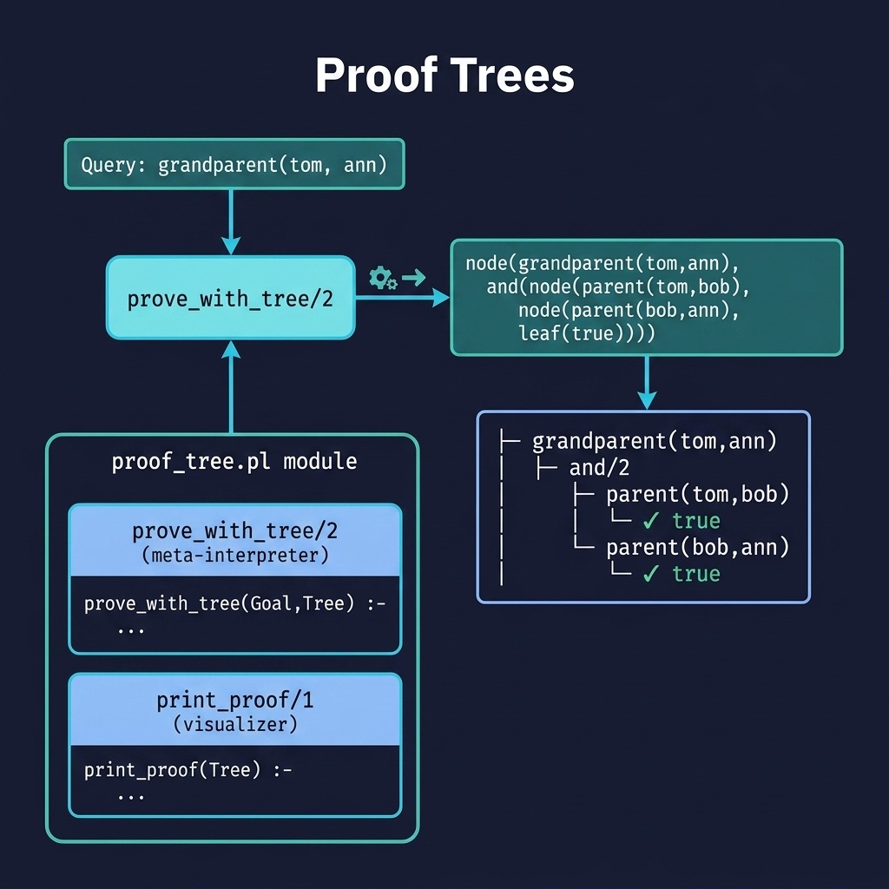

# Proof Trees

Visual explanation of reasoning through proof tree construction. Companion code for the Meta-Interpreters chapter.

## Running Examples

```shell
swipl -s load.pl
```

```prolog
?- assert((grandparent(X,Z) :- parent(X,Y), parent(Y,Z))).
?- assert(parent(tom,bob)), assert(parent(bob,ann)).
?- prove_with_tree(grandparent(tom,ann), Tree), print_proof(Tree).
```

## Running Tests

```shell
swipl -g "['tests/test_proof_tree.pl'], run_tests, halt" -s load.pl
```


## Architecture



## Description

Extends the meta-interpreter concept to build and display proof trees — a key capability for explainable AI. The `proof_tree.pl` module's `prove_with_tree/2` predicate traces each inference step, constructing a tree of `node/2`, `and/2`, and `leaf/1` terms. The `print_proof/1` predicate pretty-prints this tree with Unicode box-drawing characters and indentation, showing exactly which rules and facts were used to derive a conclusion.
