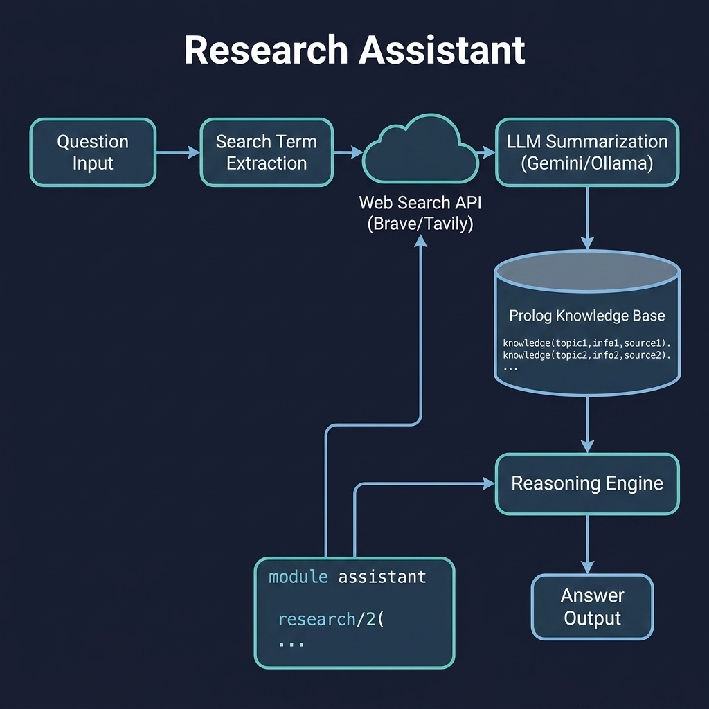

# Research Assistant

**Status: experimental skeleton.** The predicates load and the placeholder `research/2` returns a `placeholder_answer(Question)` term, but the real web-search → LLM-summarise → Prolog-knowledge-base pipeline is not yet implemented.

An agent combining web search, LLM summarization, and Prolog reasoning. Companion code for the Building AI Agents chapter.

## Running Examples

The module loads, but only the placeholder is runnable:

```shell
swipl -s load.pl
```

```prolog
?- research("What is Prolog?", Answer).   % returns placeholder_answer(...) only
```

## Running Tests

```shell
swipl -g "['tests/test_assistant.pl'], run_tests, halt" -s load.pl
```

The single test is marked `blocked('pipeline not yet implemented')`, so the run reports zero passing tests — this is intentional.


## Architecture



## Description

A practical agent case study that chains together web search (via REST APIs), LLM summarization (Gemini/Ollama), and Prolog knowledge storage and reasoning. The intended workflow: parse the question → search the web → summarize results via LLM → store structured knowledge as Prolog facts → reason over the knowledge base to produce an answer. Currently a skeleton awaiting integration with the `llm_client` and `http_client` projects.
