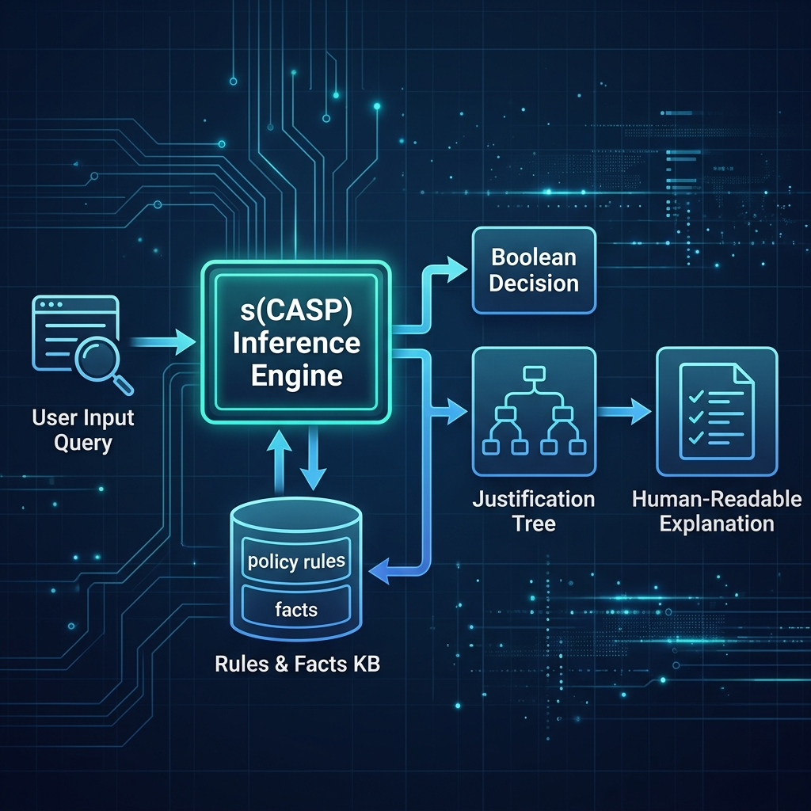

# Explainable AI & Computational Law with s(CASP)

This project demonstrates how to implement **Explainable AI (XAI)** and **Computational Law (Rules as Code)** using the `s(CASP)` reasoning engine.

## Why This Project is Useful
Traditional machine learning algorithms act as "black boxes" — they output predictions but cannot explain the reasoning behind them. In safety-critical or regulated domains (e.g., law, tax compliance, healthcare), decisions must be auditable and explainable.

`s(CASP)` (Goal-Directed Answer Set Programming) is a modern logic programming system that solves this by generating **justification trees** (proof trees). When a compliance rule is evaluated, the system doesn't just output `true` or `false`; it constructs an explicit, human-readable trace detailing exactly which policies and facts were satisfied, and which exceptions were evaluated but not met.

## Tools & Libraries Used
- **SWI-Prolog**: The execution environment.
- **`library(scasp)`**: The SWI-Prolog library for goal-directed Answer Set Programming.

## Project Architecture
Refer to the architecture diagram for an overview of the system flow:



## How to Run the Example
Start SWI-Prolog and load the file:
```bash
swipl compliance_check.pl
```

Then query the compliance check for `alice`:
```prolog
?- run_compliance_check(alice).
```

Output:
```text
alice is eligible.

Justification Tree:
alice is eligible for travel reimbursement, because:
  alice is a registered employee, and
  alice's trip was for business purposes, and
  there is no evidence that alice's trip was for personal reasons, and
  there is no evidence that alice has exceeded the travel expense limit of $500.
```
