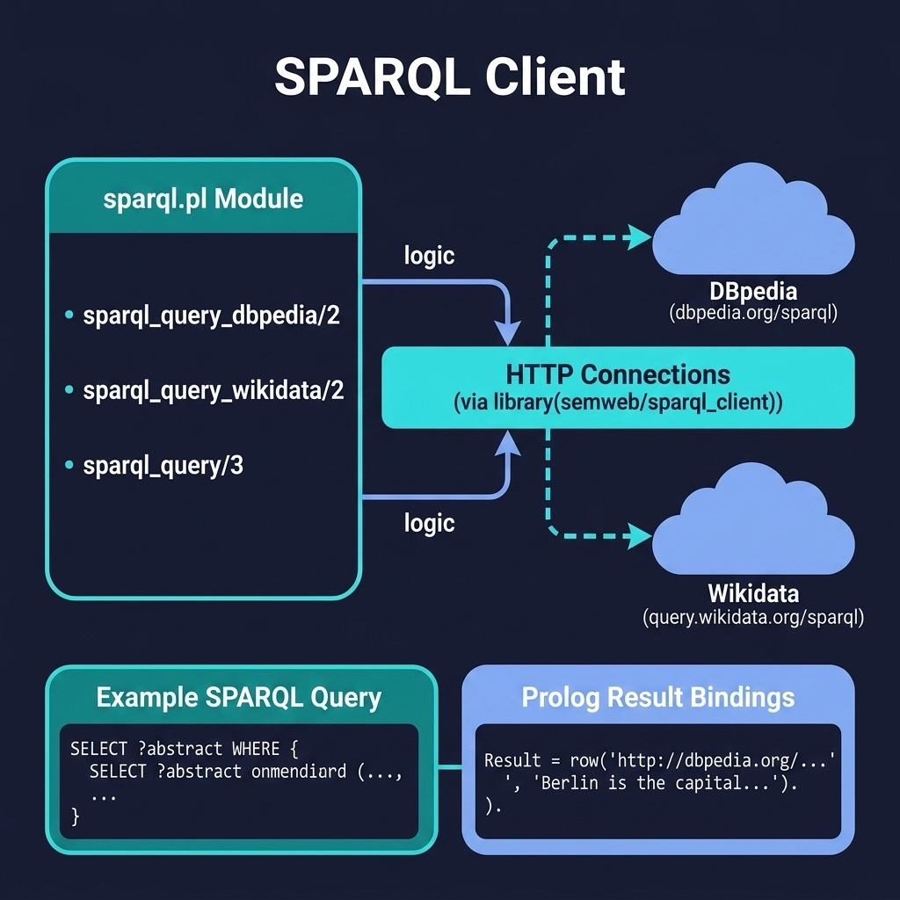

# SPARQL Client

Query remote SPARQL endpoints (DBpedia, Wikidata) from Prolog. Companion code for the Semantic Web and Linked Data chapter.

## Running Examples

```shell
cd source-code/sparql_client
swipl -s load.pl
```

```prolog
?- sparql_query_dbpedia(
       'SELECT ?name WHERE { <http://dbpedia.org/resource/Prolog_(programming_language)> rdfs:label ?name . FILTER(lang(?name) = "en") }',
       Results).

%% Wikidata demo (requires network)
?- wikidata_query(
       'SELECT ?item ?itemLabel WHERE { ?item wdt:P31 wd:Q5 . SERVICE wikibase:label { bd:serviceParam wikibase:language "en" . } } LIMIT 3',
       Results).
```

## Tests

The quoting helpers build safe query fragments from user data:

```prolog
?- sparql_literal('The "Prolog" language', Lit).
Lit = '"The \\"Prolog\\" language"'.
?- sparql_iri('http://www.wikidata.org/entity/Q22871', Iri).
Iri = '<http://www.wikidata.org/entity/Q22871>'.
```

Unit tests cover only the offline quoting helpers; live endpoint
queries are demonstrated above and must be run manually.

## Running Tests

```shell
swipl -g "['tests/test_sparql.pl'], run_tests, halt" -s load.pl
```


## Architecture



## Description

Provides a Prolog interface to remote SPARQL endpoints using SWI-Prolog's `library(semweb/sparql_client)`. The module includes convenience predicates for querying DBpedia and Wikidata, two of the largest public linked data sources. This allows Prolog programs to access vast external knowledge bases and combine the results with local reasoning — a powerful pattern for AI applications that need both structured web data and logical inference.
