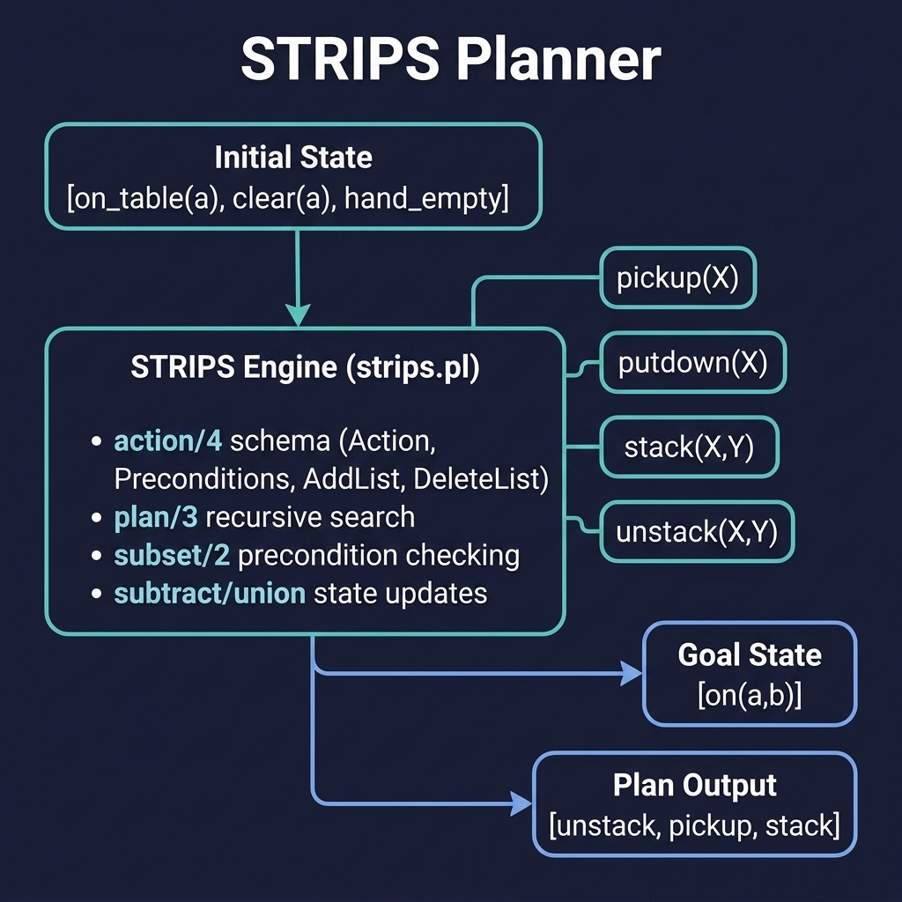

# STRIPS Planner

Classical AI planning with STRIPS-style preconditions and effects. Companion code for the Planning and Scheduling chapter.

## Running Examples

```shell
swipl -s load.pl
```

Blocks world queries:
```prolog
?- plan([on_table(a), clear(a), hand_empty], [holding(a)], Plan).
?- plan_bfs([on_table(a), on_table(b), clear(a), clear(b), hand_empty],
            [on(a, b)], Plan).
?- plan_bfs([on_table(a), on_table(b), on_table(c),
             clear(a), clear(b), clear(c), hand_empty],
            [on(a, b), on(b, c)], Plan).
```

Logistics domain queries:
```prolog
?- plan_bfs([pkg_at(pkg1, loc_a), truck_at(truck1, loc_a), free(truck1),
             road(loc_a, loc_b), road(loc_b, loc_a)],
            [pkg_at(pkg1, loc_b)], Plan).
```

## Running Tests

```shell
swipl -g "['tests/test_strips.pl'], run_tests, halt" -s load.pl
```


## Architecture



## Description

Implements the STRIPS planning algorithm where actions are defined by preconditions, add lists, and delete lists. Three planner variants are provided:

- **`plan/3`** — Depth-first search. Concise and elegant, but may loop on reversible actions.
- **`plan_bfs/3`** — Breadth-first search. Guaranteed to find the shortest plan.
- **`plan_visited/3`** — DFS with cycle detection. Practical compromise for most domains.

Two domains are included: the classic blocks world (pickup, putdown, stack, unstack) and a logistics domain (trucks, planes, and packages with load/unload/drive/fly operators). The custom `holds/2` predicate uses `member/2` instead of the standard `subset/2` so that action-schema variables can bind to any matching state element.
