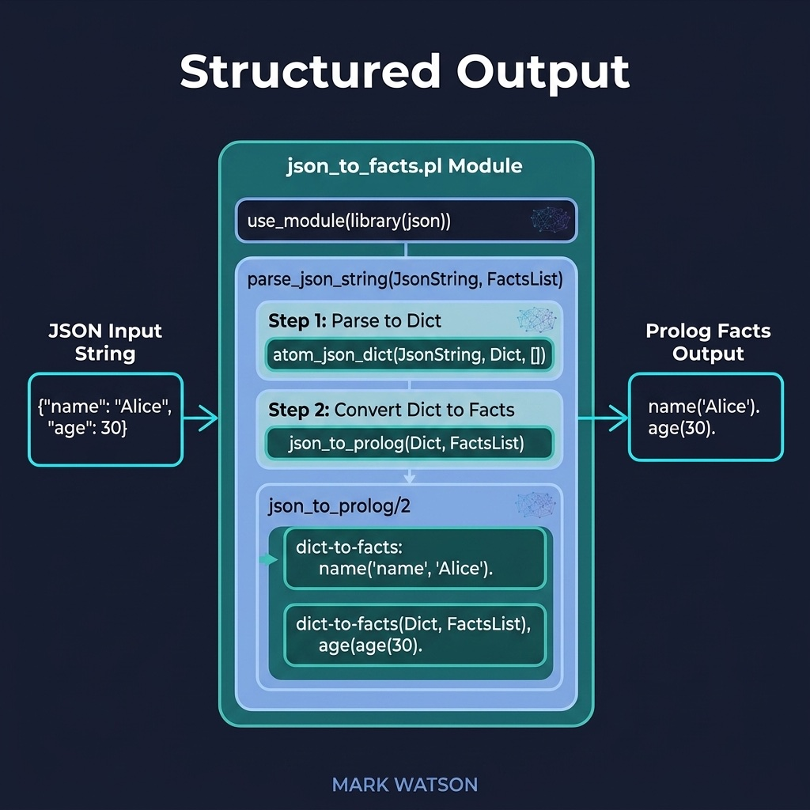

# Structured Output

Parse LLM JSON responses into queryable Prolog facts. Companion code for the Integrating with LLMs chapter.

## Running Examples

```shell
swipl -s load.pl
```

```prolog
?- json_string_to_facts('{"entities":[{"name":"Paris","type":"city"}]}').
?- extracted_entity(Name, Type).
```

## Running Tests

```shell
swipl -g "['tests/test_json_facts.pl'], run_tests, halt" -s load.pl
```


## Architecture



## Description

Bridges the gap between LLM text output and Prolog's structured reasoning. The `json_to_facts.pl` module parses JSON containing entities and relations arrays, asserting them as `extracted_entity/2` and `extracted_relation/3` facts. This enables a workflow where an LLM extracts structured information from text and Prolog reasons over the results.
