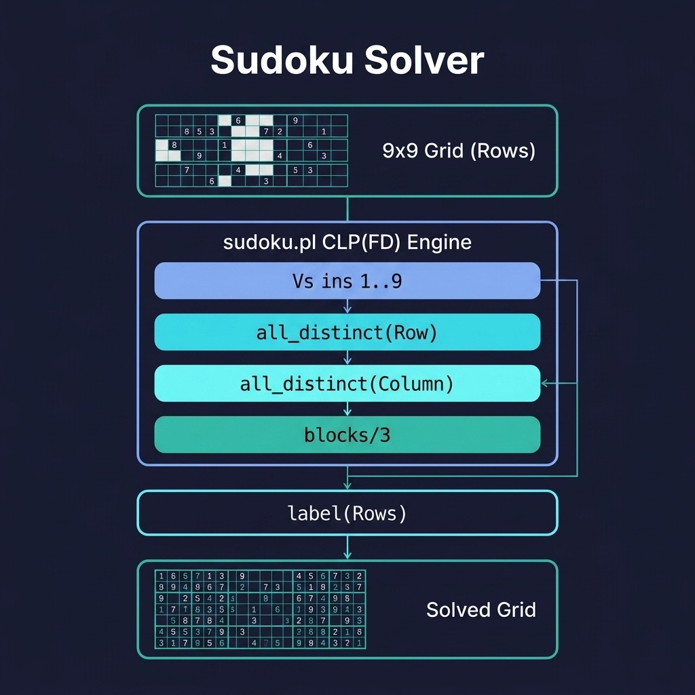

# Sudoku Solver

A 9×9 Sudoku solver using CLP(FD) constraint satisfaction. Companion code for the Constraint Logic Programming chapter.

## Running Examples

```shell
cd source-code/sudoku_solver
swipl -s load.pl
```

```prolog
?- Puzzle = [[5,3,_,_,7,_,_,_,_],
             [6,_,_,1,9,5,_,_,_],
             [_,9,8,_,_,_,_,6,_],
             [8,_,_,_,6,_,_,_,3],
             [4,_,_,8,_,3,_,_,1],
             [7,_,_,_,2,_,_,_,6],
             [_,6,_,_,_,_,2,8,_],
             [_,_,_,4,1,9,_,_,5],
             [_,_,_,_,8,_,_,7,9]],
   sudoku(Puzzle), print_board(Puzzle).
```

## Running Tests

```shell
swipl -g "['tests/test_sudoku.pl'], run_tests, halt" -s load.pl
```


## Architecture



## Description

A showcase of CLP(FD)'s power — the entire Sudoku solver is under 25 lines. It constrains each cell to 1–9, enforces `all_distinct` on each row, column, and 3×3 block, then calls `label/1` to find the solution. This is one of the most compelling examples of how constraint programming in Prolog can express complex combinatorial problems declaratively, letting the constraint solver do the heavy lifting instead of writing procedural search code.
