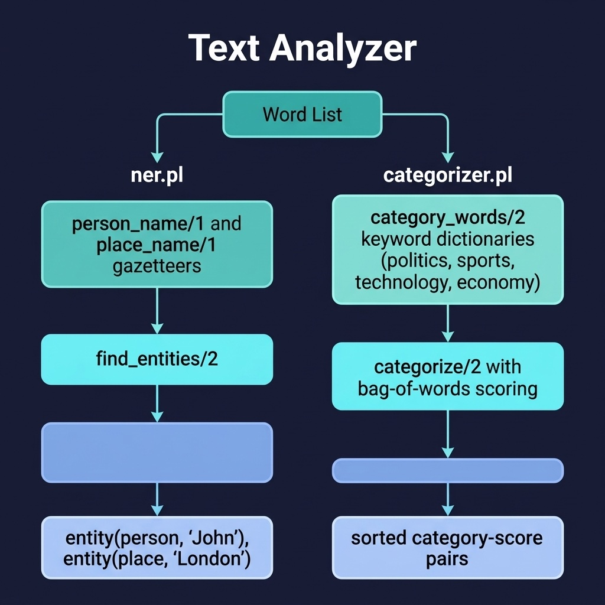

# Text Analyzer

Named entity recognition and text categorization using gazetteer lookup and bag-of-words scoring. Companion code for the NLP with DCGs chapter.

## Gazetteer Vocabulary

The NER module (`ner.pl`) recognizes **person**, **place**, and **organization** names from an expanded gazetteer of ~110 entries:

- **38 person names** — historical figures (Lincoln, Churchill, Mandela), scientists (Einstein, Newton, Turing), authors (Shakespeare, Austen, Hemingway), philosophers (Plato, Aristotle), political leaders (Obama, Thatcher, Gandhi), and modern figures (Musk, Gates).
- **57 place names** — countries (Japan, Brazil, Kenya), world cities (Tokyo, Cairo, Sydney, Dubai), US states (California, Texas, Florida), and US cities (Chicago, Boston, Seattle).
- **20 organization names** — international bodies (United_Nations, NATO, WHO), tech companies (Google, Apple, Microsoft, Tesla, Meta), space/defense (NASA, CIA, SpaceX), and brands (Nike, Toyota, Samsung).

## Categorization Vocabulary

The categorizer module (`categorizer.pl`) scores text against **8 categories** using bag-of-words keyword lists (~40 words each, ~320 total):

| Category       | Sample Keywords |
|----------------|-----------------|
| politics       | president, election, legislation, veto, amendment, filibuster |
| sports         | game, team, tournament, playoff, medal, rivalry |
| technology     | software, algorithm, network, encryption, blockchain, cloud |
| economy        | market, stock, inflation, gdp, recession, tariff |
| healthcare     | doctor, vaccine, surgery, diagnosis, pandemic, oncology |
| education      | school, professor, curriculum, dissertation, tuition, campus |
| entertainment  | movie, music, actor, streaming, festival, premiere |
| environment    | climate, renewable, carbon, biodiversity, drought, recycling |

## Running Examples

```shell
cd source-code/text_analyzer
swipl -s load.pl
```

**Named Entity Recognition:**
```prolog
?- find_entities(['Einstein', visited, 'Cambridge', to, speak, at, 'UNESCO'], Entities).
% => Entities = [entity(person,'Einstein'), entity(org,'UNESCO')]

?- find_entities(['Musk', launched, 'SpaceX', rocket, from, 'Texas'], Entities).
% => Entities = [entity(person,'Musk'), entity(org,'SpaceX'), entity(place,'Texas')]

?- find_entities(['Mandela', traveled, from, 'South_Africa', to, 'London'], Entities).
% => Entities = [entity(person,'Mandela'), entity(place,'South_Africa'), entity(place,'London')]
```

**Text Categorization:**
```prolog
?- categorize([president, election, veto, bill, congress, legislation], Categories).
% => Categories = [6-politics]   (6 keyword hits, all in politics)

?- categorize([stock, market, inflation, revenue, bank, gdp, recession], Categories).
% => Categories = [7-economy]

?- categorize([pandemic, hospital, vaccine, doctor, nurse, surgery, diagnosis], Categories).
% => Categories = [7-healthcare]

?- categorize([climate, renewable, solar, carbon, biodiversity, drought], Categories).
% => Categories = [6-environment]

?- categorize([president, debate, stock, market], Categories).
% => Categories = [2-politics, 2-economy]   (ties are sorted alphabetically)

?- categorize([classroom, teacher, exam, vaccine, pandemic, doctor], Categories).
% => Categories = [3-education, 3-healthcare]
```

## Running Tests

```shell
swipl -g "['tests/test_ner.pl'], run_tests, halt" -s load.pl
```

## Architecture



## Description

Implements two lightweight NLP techniques in pure Prolog. The `ner.pl` module performs named entity recognition by matching input words against expanded gazetteer lists of known person, place, and organization names, returning typed `entity(Type, Name)` terms. The `categorizer.pl` module uses a bag-of-words approach with keyword lists for eight categories (politics, sports, technology, economy, healthcare, education, entertainment, environment), scoring input text against each category and returning ranked results. Both modules are intentionally simple to demonstrate the pattern before scaling up with LLM or Janus-based approaches in later chapters.