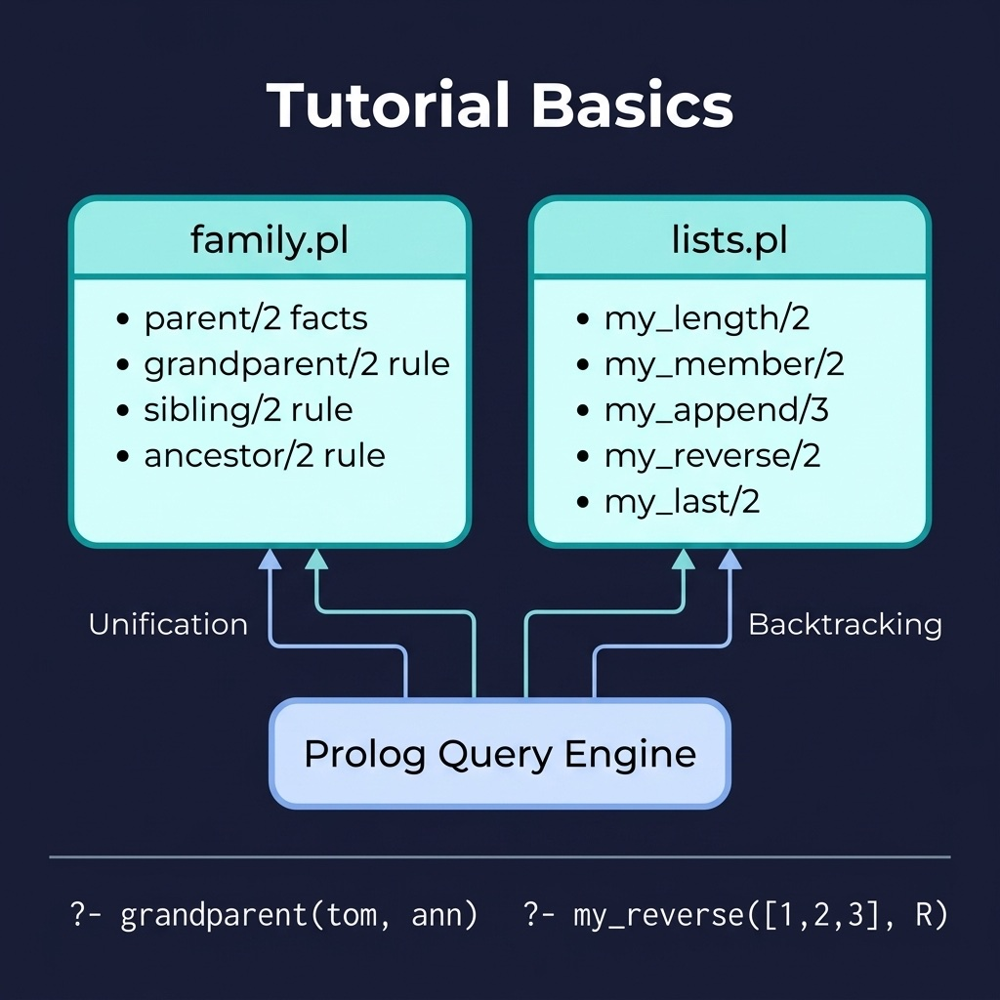

# Tutorial Basics

Fundamental Prolog examples covering facts, rules, queries, unification, backtracking, and list processing. This is the companion code for the Prolog Tutorial chapter.

## Running Examples

```shell
cd source-code/tutorial_basics
swipl -s load.pl
```

Then try queries in the REPL:

```prolog
?- parent(tom, bob).
?- grandparent(tom, ann).
?- sibling(ann, pat).
?- my_reverse([1,2,3], R).
```

## Running Tests

```shell
swipl -g "['tests/test_family.pl', 'tests/test_lists.pl'], run_tests, halt" -s load.pl
```


## Architecture



## Description

The `family.pl` module demonstrates core Prolog concepts through family relationships — defining facts (`parent/2`), building rules (`grandparent/2`, `sibling/2`, `ancestor/2`), and querying them with backtracking. The naive `ancestor/2` assumes acyclic data; `ancestor_within/3` provides a depth-bounded, always-terminating variant.

The `lists.pl` file (module `my_lists`) implements classic list operations (`length`, `member`, `append`, `reverse`, `last`) from scratch using recursion and pattern matching, showing how Prolog's head/tail list decomposition works. `my_length/2` is bidirectional (built on CLP(FD) arithmetic), so both `my_length([a,b,c], N)` and `my_length(L, 3)` work.

> Module naming note: the module is called `my_lists` although the file is `lists.pl`, because a module literally named `lists` shadows SWI-Prolog's `library(lists)`, which `library(plunit)` and `library(clpfd)` depend on.
